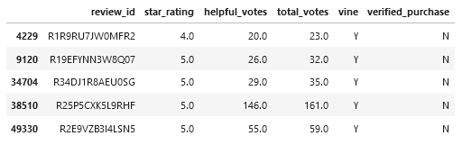
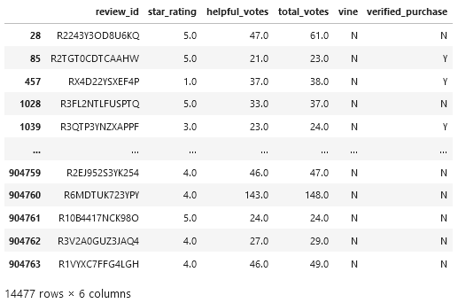

# amazon-vine-analysis

# Overview
This project analyzes Amazon Review scores for musical instruments to see if there was any bias in Vine reviews (where customers were paid or sponsored to leave a review) versus non-Vine reviews.

The dataset was taken from the [Amazon Review Datasets](https://s3.amazonaws.com/amazon-reviews-pds/tsv/index.txt) and extracted, transformed, and loaded into four tables in a database using Google's Colaboratory. The tables were exported into .csv files, and the Vine vs. non-Vine reviews were analyzed using pandas in jupyter-lab.

# Results
**Table of Vine (Paid) Reviews**

**Table of Non-Vine (Unpaid) Reviews**

----------------------------------------------------------------
**Vine (Paid) Reviews**
- Total Vine Reviews: **60**
- Total Vine 5 Star Reviews: **34**
- Percent Vine 5 Star Reviews: **56.67%**

**Non-Vine (Unpaid) Reviews**
- Total Non-Vine Reviews: **14,477**
- Total Non-Vine 5 Star Reviews: **8,212**
- Percent Non-Vine 5 Star Reviews: **56.72%**

# Summary
Based on the results, there does not appear to be any bias in the Vine reviews. Both the Vine and non-Vine reviews have extremely similar 5 star review percentages. However, it would be worth looking into the distribution of reviews for the other star ratings (1-4) to see if those might reveal any bias.
